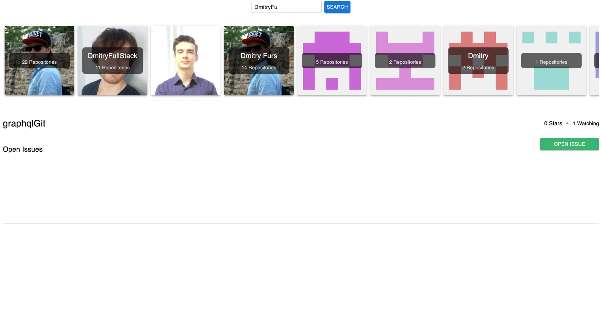

# React github search

A modern web application built with **React** allowing users to interact with gitHub directly in the browser.

---

## 🚀 Features

- 🌐 GitHub search, issues and repos
- 🎨 Mui for styling
- 📱 Responsive and mobile-friendly design

---

## 📦 Set up environment variables

   ```
    REACT_APP_CLIENT_ID=<your Github client ID>
   ```

## 🧪 Tech Stack

- React – Frontend framework
- Graphql - to interact with gitHab graphql API
- MUI – styling

## Backend

It is here https://github.com/DmitryFullStackDev/GitOAuth/tree/main

## ✨ Demo

Experience the app simulation live:
https://graphql-git.vercel.app/ 🔥

## 🧩Interface


